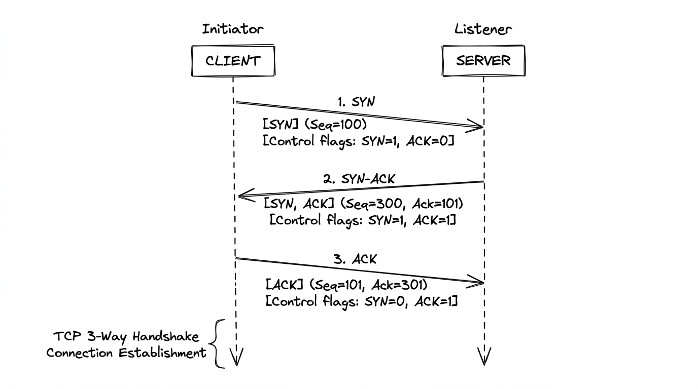

# Network Basics for Hackers
## Module 01 - Network Basics

---

## Overview

The foundation of network security begins here. You can't break what you don't understand. Every communication on the internet relies on IP addressing, port mappings, and transport protocols like TCP and UDP. This module covers core networking mechanisms, the OSI model layers, OS fingerprinting heuristics, and how to map target attack surfaces using `nmap`.

---

## IP Addresses

Every device on a network needs an address. That's it. Without one, nobody knows where to send your data.

Think of it like a home address. The internet is the postal system, packets are the mail. No address, no delivery.

Two versions exist right now:

| Version | Example | Notes |
|---------|---------|-------|
| IPv4 | `192.168.1.1` | 32-bit, ~4.3 billion addresses. We ran out. |
| IPv6 | `2001:0db8::1` | 128-bit, essentially unlimited |

### Public vs. Private IPs

Not every IP is reachable from the internet. Private ranges exist only inside local networks:

```
10.0.0.0    - 10.255.255.255
172.16.0.0  - 172.31.255.255
192.168.0.0 - 192.168.255.255
```

If your machine is on `192.168.x.x`, you're behind a router. The internet only sees your router's public IP, not yours directly.

> **Common mistake:** Trying to reach a private IP from outside the network won't work. You need to be inside the network or connected through a VPN.

---

## NAT - Network Address Translation

IPv4 ran out of addresses, so NAT was the fix.

Your router has one public IP. Every device inside your home gets a private IP. When you send traffic out, the router swaps your private IP with its own public IP, sends the packet, then tracks the request so it can deliver the reply back to you.

```
[Your laptop 192.168.1.5] --> [Router (NAT) 203.0.113.1] --> [Internet]
                                       |
                          tracks which device made each request
```

Good analogy: an apartment building with one street address. The mailroom takes all incoming mail and figures out which tenant it belongs to. That's NAT.

---

## Ports

IP address gets you to the right machine. Port gets you to the right service on that machine.

Ports are just numbers, 0 to 65535. The well-known ones are locked to specific services:

| Port | Protocol | What it does |
|------|----------|-------------|
| 80 | HTTP | Standard web traffic |
| 443 | HTTPS | Encrypted web traffic |
| 53 | DNS | Name to IP resolution |
| 22 | SSH | Remote terminal access |
| 25 | SMTP | Sending email |
| 21 | FTP | File transfer |

When you visit a website, your browser hits port 443. SSH into a server, you're hitting port 22. The port tells the OS which application handles the incoming connection.

---

## TCP vs. UDP

Two main transport protocols. Very different behavior.

**TCP (Transmission Control Protocol)**
- Connection-based. Both sides agree to talk before data moves.
- Reliable. Every packet gets acknowledged, missing ones get resent.
- Slower because of all that back-and-forth.
- Used for: web browsing, SSH, email, file transfers.

**UDP (User Datagram Protocol)**
- No connection setup. Just fires packets and moves on.
- Fast, low overhead.
- No guarantees. Packets can be lost or arrive out of order.
- Used for: DNS, video streaming, VoIP, online games.

```
TCP: "Did you get that?" / "Yes." / "Ok, sending more."
UDP: *throws data into the void and hopes for the best*
```

UDP isn't broken. It's a deliberate trade-off. For streaming video, a dropped frame is better than freezing everything to resend it.

---

## TCP Three-Way Handshake

Before TCP moves any real data, both sides do a quick setup to establish the connection.



```
Client                    Server
  |                          |
  |------ SYN -------------->|   "Hey, I want to connect"
  |                          |
  |<----- SYN/ACK -----------|   "Cool, I'm here. You ready?"
  |                          |
  |------ ACK -------------->|   "Ready. Let's go."
  |                          |
  |======= Data flows ========|
```

**SYN** = Synchronize
**ACK** = Acknowledge

This matters for hacking. A SYN scan (`nmap -sS`) sends a SYN, waits for SYN/ACK (open port) or RST (closed port), then never completes the handshake. Stealthier because no full connection gets logged.

---

## The OSI Model

Seven layers that describe how network communication works. Each layer has one job. Layers only talk to the ones directly above and below them.

```
Layer 7 - Application    | HTTP, DNS, SMTP, FTP
Layer 6 - Presentation   | Encryption, encoding (TLS/SSL)
Layer 5 - Session        | Managing connections
Layer 4 - Transport      | TCP / UDP (ports live here)
Layer 3 - Network        | IP addressing, routing
Layer 2 - Data Link      | MAC addresses, switches
Layer 1 - Physical       | Cables, signals, hardware
```

Different attacks happen at different layers. This is why it matters:

- ARP spoofing - Layer 2
- IP spoofing - Layer 3
- Port scanning, SYN floods - Layer 4
- SQL injection, XSS - Layer 7

When someone says "Layer 3 attack" or "application-layer exploit," this is the reference.

---

## OS Fingerprinting

Passive recon trick. Packets carry subtle clues about the OS that sent them. Specifically the **TTL (Time to Live)** value and the **TCP Window Size**.

| OS | Typical TTL |
|----|------------|
| Linux | 64 |
| Windows | 128 |
| Cisco/Network gear | 255 |

TTL drops by 1 at each hop. Receive a packet with TTL 118, that's likely a Windows machine 10 hops away (128 - 10 = 118).

`nmap` and `p0f` automate this. But even just reading a packet in Wireshark and checking the TTL tells you something useful.

---

## nmap - Port Scanning

The standard tool for mapping what's running on a target. Shows open ports, likely services, and sometimes the OS.

```bash
# Basic scan - top 1000 ports
ahegazy0@kali:~$ nmap 192.168.1.1

# Full TCP connect scan (completes the handshake - noisy but reliable)
ahegazy0@kali:~$ sudo nmap -sT 192.168.1.1

# SYN scan (half-open, stealthier, needs root)
ahegazy0@kali:~$ sudo nmap -sS 192.168.1.1

# Detect service versions
ahegazy0@kali:~$ nmap -sV 192.168.1.1

# OS detection
ahegazy0@kali:~$ sudo nmap -O 192.168.1.1

# Scan all 65535 ports
ahegazy0@kali:~$ nmap -p- 192.168.1.1

# Aggressive scan (OS + version + scripts + traceroute)
ahegazy0@kali:~$ sudo nmap -A 192.168.1.1
```

Open port = potential attack surface. The goal is to build a map of what's exposed.

---

## Quick Reference

| Concept | Value | Notes |
|---------|-------|-------|
| HTTP | Port 80 | Unencrypted web |
| HTTPS | Port 443 | Encrypted web |
| SSH | Port 22 | Remote shell |
| DNS | Port 53 | Name resolution |
| SMTP | Port 25 | Email sending |
| Private IP | 192.168.x.x / 10.x.x.x | Not routable on internet |
| TCP handshake | SYN > SYN/ACK > ACK | Required before data transfer |
| Linux TTL | 64 | OS fingerprinting hint |
| Windows TTL | 128 | OS fingerprinting hint |

---

## Practice

```bash
# Check your own IP addresses
ahegazy0@kali:~$ ip a

# Scan your own machine
ahegazy0@kali:~$ nmap localhost
ahegazy0@kali:~$ sudo nmap -sS localhost

# See active connections right now
ahegazy0@kali:~$ ss -tulnp
```

- [ ] Check your own IP addresses using `ip a` and identify your private vs public IP.
- [ ] Run `nmap localhost` and `sudo nmap -sS localhost`. What ports are open, and what services handle them?
- [ ] Inspect active listening sockets with `ss -tulnp`.
- [ ] Reflect on transport trade-offs: Why does UDP not care if packets arrive? In what scenarios is that preferred?

> 💡 *For deeper practice, I also recommend completing the end-of-chapter exercises in the official **Network Basics for Hackers** book.*

---

*Up next: Module 02 - Subnetting & CIDR*
