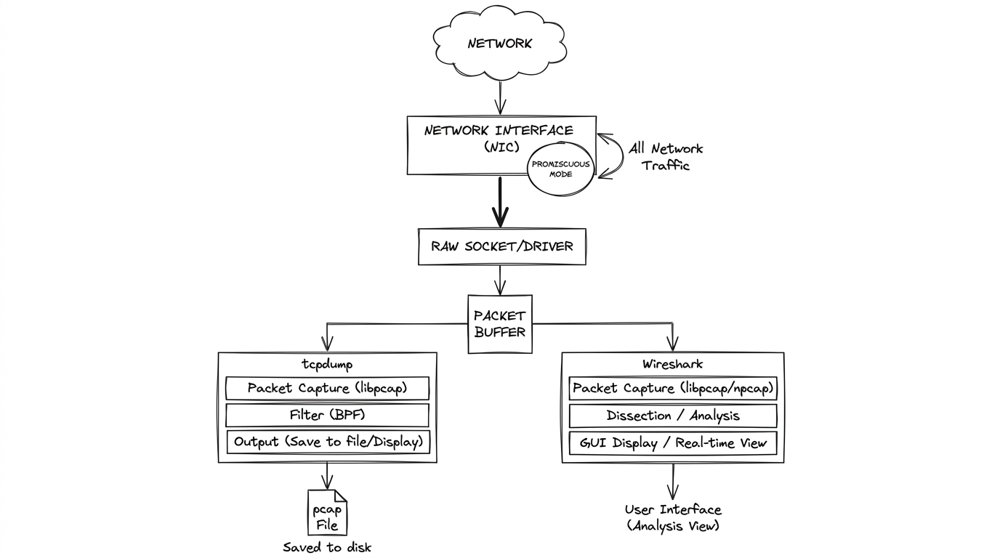

# Network Basics for Hackers
## Module 03 - Network Analysis

---

## Overview

Network analysis is the practice of capturing and decoding packets directly from the transmission medium. Whether verifying normal application traffic or hunting for cleartext credentials and signs of intrusion, packet analysis with tools like `tcpdump` and Wireshark provides ground truth of what actually travels across the wire.

---

## Promiscuous Mode

By default, your network card only picks up packets addressed to your machine. Everything else gets ignored at the hardware level.

Promiscuous mode turns that filter off. Your card captures everything passing by - broadcasts, traffic meant for other machines, all of it.



```bash
# Enable promiscuous mode manually
ahegazy0@kali:~$ sudo ip link set eth0 promisc on

# Verify (look for "PROMISC" in the flags)
ahegazy0@kali:~$ ip link show eth0
```

Most sniffers like Wireshark and tcpdump enable this automatically when they start. But it's worth knowing what it means - without it you're only seeing your own traffic, which isn't very useful.

One thing to know: on a switched network, promiscuous mode alone only gets you traffic on your local segment. Switches send packets only to the right port. To capture other hosts' traffic on a switch, you need ARP poisoning or a mirror port. That's a later module.

---

## tcpdump

Command-line packet sniffer. No GUI, no setup. Runs on servers, embedded systems, anything with a terminal. This is what you use when Wireshark isn't an option.

```bash
# Basic capture on an interface
ahegazy0@kali:~$ sudo tcpdump -i eth0

# Save to a file, open in Wireshark later
ahegazy0@kali:~$ sudo tcpdump -i eth0 -w capture.pcap

# Read a saved capture
ahegazy0@kali:~$ tcpdump -r capture.pcap

# Only show HTTP traffic
ahegazy0@kali:~$ sudo tcpdump -i eth0 port 80

# Filter by host
ahegazy0@kali:~$ sudo tcpdump -i eth0 host 192.168.1.50

# Show packet contents in ASCII (great for spotting cleartext)
ahegazy0@kali:~$ sudo tcpdump -i eth0 -A port 80

# Combine filters
ahegazy0@kali:~$ sudo tcpdump -i eth0 host 192.168.1.1 and port 443

# Hunt for login keywords in cleartext traffic
ahegazy0@kali:~$ sudo tcpdump -i eth0 -A | grep -i "pass\|login\|user\|username"
```

The raw output looks confusing at first:

```
14:32:11.482910 IP 192.168.1.5.54231 > 93.184.216.34.80: Flags [S], seq 0, win 64240
```

Left to right: timestamp, source IP.port, destination IP.port, TCP flags, sequence number, window size.

`[S]` = SYN. `[S.]` = SYN/ACK. `[.]` = ACK. `[P.]` = PUSH (actual data). `[F.]` = FIN (closing).

Once you read a few captures, this becomes second nature.

---

## Wireshark

The full visual experience. Same idea as tcpdump but with a GUI that lets you dig into every field of every layer of every packet.

Three panes when you open a capture:

```
+-----------------------------------------------------+
|  Packet List  - one row per packet, high-level info  |
+-----------------------------------------------------+
|  Packet Details  - expandable protocol tree          |
|    > Frame                                           |
|    > Ethernet II                                     |
|    > Internet Protocol (IP)                          |
|    > Transmission Control Protocol (TCP)             |
|    > Hypertext Transfer Protocol (HTTP)              |
+-----------------------------------------------------+
|  Packet Bytes  - raw hex and ASCII side by side      |
+-----------------------------------------------------+
```

The filter bar is where the real power is. Large captures have thousands of packets. You need to cut through the noise fast.

```
# Only HTTP traffic
http

# Traffic to or from a specific IP
ip.addr == 192.168.1.50

# Only DNS queries
dns

# Only new TCP connections (SYN only, no ACK)
tcp.flags.syn == 1 && tcp.flags.ack == 0

# Find packets containing specific text
frame contains "password"
frame contains "login"
```

**Follow TCP Stream** is one of the most useful features. Right-click any packet, Follow, TCP Stream. It reassembles the full conversation between two hosts into one readable window. On unencrypted protocols you can read everything.

The Statistics menu is something beginners often skip. "Protocol Hierarchy" shows a breakdown of everything in the capture by protocol with percentages. If 40% of traffic is some protocol you don't recognize, that's worth looking into.

---

## What Cleartext Traffic Actually Looks Like

On any HTTP site (no TLS), everything is readable. Literally everything.

Someone submits a login form over HTTP:

```
POST /login HTTP/1.1
Host: example.com
Content-Type: application/x-www-form-urlencoded

username=john&password=hunter2
```

That's not a demo. That's what it looks like in Wireshark's TCP stream view. No cracking, no exploitation. Just reading.

Same thing with cookies. If a session cookie gets sent over HTTP, you can copy it and replay it in your own browser to hijack the session. This is called a session hijack and it works directly from the capture. HTTPS encrypts all of this. You'd see the TLS handshake and then unreadable noise.

---

## netstat - What Is Your Machine Doing Right Now

`netstat` shows active connections and listening ports on your own machine. Good for baselining what's normal and spotting things that shouldn't be there.

```bash
# All connections and listening ports
ahegazy0@kali:~$ netstat -a

# Show process names with ports (needs root)
ahegazy0@kali:~$ sudo netstat -tulnp

# Only established connections
ahegazy0@kali:~$ netstat -an | grep ESTABLISHED

# Only listening ports
ahegazy0@kali:~$ netstat -an | grep LISTEN

# Check for web connections
ahegazy0@kali:~$ netstat -a | grep :80
ahegazy0@kali:~$ netstat -a | grep :443

# On modern Linux, ss is faster
ahegazy0@kali:~$ ss -tulnp
```

On a machine you know well, netstat is routine. On a machine you're investigating, it can reveal backdoors - unexpected listening ports, outbound connections to strange IPs, processes that have no business on the network.

---

## Other Useful Commands

```bash
# Your IP addresses and MAC address
ahegazy0@kali:~$ ip a

# Test if a host is up
ahegazy0@kali:~$ ping -c 4 8.8.8.8

# Trace the route packets take
ahegazy0@kali:~$ traceroute google.com

# Show ARP cache (IP to MAC mappings your machine knows)
ahegazy0@kali:~$ arp -a

# DNS lookups
ahegazy0@kali:~$ dig google.com
```

`traceroute` is underrated. It shows every router hop between you and a destination with response times. Useful for understanding network topology and spotting traffic being routed somewhere unexpected.

---

## A Typical Analysis Workflow

```
1. Capture traffic
   -> sudo tcpdump -i eth0 -w session.pcap

2. Open in Wireshark
   -> wireshark session.pcap

3. Orient yourself
   -> Statistics > Protocol Hierarchy (what protocols are here?)
   -> Statistics > Conversations (who is talking to who?)

4. Filter down
   -> http, dns, tcp.flags.syn==1, ip.addr==x.x.x.x

5. Follow interesting streams
   -> Right-click > Follow > TCP Stream

6. Export if needed
   -> File > Export Objects > HTTP (grabs files transferred over HTTP)
```

---

## Quick Reference

| Tool | What It Does |
|------|-------------|
| `tcpdump` | CLI packet capture, fast, works anywhere |
| `wireshark` | GUI capture and deep analysis |
| `netstat` / `ss` | Active connections and listening ports |
| `ip a` / `ifconfig` | Your IP and MAC addresses |
| `ping` | Test if a host responds |
| `traceroute` | Map the route to a destination |
| `arp -a` | Local IP to MAC mappings |

---

## Practice

```bash
# 1. Capture traffic to a pcap file
ahegazy0@kali:~$ sudo tcpdump -i eth0 -w ~/test.pcap

# 2. Inspect captured pcap with Wireshark
ahegazy0@kali:~$ wireshark ~/test.pcap

# 3. Check active listening sockets and established connections
ahegazy0@kali:~$ ss -tulnp
ahegazy0@kali:~$ ss -t state established
```

- [ ] Capture traffic on your primary interface using `tcpdump -i eth0 -w capture.pcap` while generating HTTP requests.
- [ ] Open the capture in Wireshark, apply the `http` display filter, and inspect request headers in the middle pane.
- [ ] Use **Follow > TCP Stream** on an unencrypted session to reconstruct the client-server conversation.
- [ ] Inspect active sockets on your host with `ss -tulnp` and identify processes tied to listening ports.
- [ ] Explain why promiscuous mode on a switched Ethernet segment behaves differently than on open wireless networks.

> 💡 *For deeper practice, I also recommend completing the end-of-chapter exercises in the official **Network Basics for Hackers** book.*

---

*Up next: Module 04 - Linux Firewalls (iptables)*
