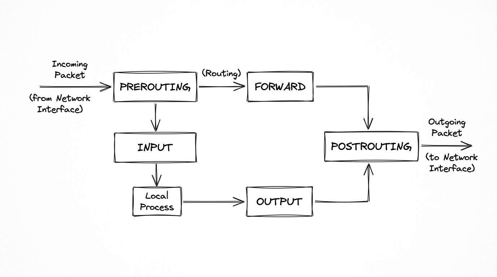

# Network Basics for Hackers
## Module 04 - Linux Firewalls (iptables)

---

## Overview

A firewall monitors and filters incoming and outgoing network traffic based on configured security rules. On Linux, `iptables` directly manages the Netfilter packet filtering subsystem within the kernel. Understanding rule traversal, chains, states, and default policies allows you to secure endpoints and anticipate defensive filtering during reconnaissance.

---

## Tables and Chains

iptables organizes rules into **tables**. For basic firewall work, the only one you really need is the `filter` table. That's the default and it handles all allow/deny decisions.



Inside the filter table there are three **chains**:

```
INPUT    ->  traffic coming INTO your machine
OUTPUT   ->  traffic LEAVING your machine
FORWARD  ->  traffic passing THROUGH (only if you're routing)
```

Each chain is its own list of rules. Three separate bouncers - one at the entrance, one at the exit, one for people passing through. A packet hits the right chain and gets walked down the list until something matches.

---

## Basic Syntax

```bash
ahegazy0@kali:~$ sudo iptables -A INPUT -s <source_IP> -j DROP
```

Breaking it down:

- `-A INPUT` - **A**ppend this rule to the INPUT chain
- `-s <IP>` - match packets from this **s**ource IP
- `-j DROP` - **j**ump to this action when the rule matches

Three actions you'll use constantly:

| Action | What happens |
|--------|-------------|
| `ACCEPT` | Packet gets through |
| `DROP` | Silently discarded. Sender gets no response. |
| `REJECT` | Discarded, but sender gets an error back |

DROP vs REJECT matters. DROP makes your machine look like it doesn't exist. No reply, nothing. An attacker scanning gets silence, which is less information for them. REJECT at least confirms something is alive at that address. For inbound blocking, DROP is almost always better.

---

## Rule Order - This Is Where People Get Burned

iptables reads rules **top to bottom and stops at the first match**. The order you add rules is the order they run. This trips up beginners constantly.

Classic mistake:

```bash
# Drop everything
ahegazy0@kali:~$ sudo iptables -A INPUT -j DROP

# Allow SSH - this will NEVER fire
ahegazy0@kali:~$ sudo iptables -A INPUT -p tcp --dport 22 -j ACCEPT
```

That SSH rule is dead. Every packet hits DROP first and gets discarded before iptables even checks the second rule. You've locked yourself out.

Correct order - specific rules first, broad rules last:

```bash
# Allow SSH first
ahegazy0@kali:~$ sudo iptables -A INPUT -p tcp --dport 22 -j ACCEPT

# Allow replies to connections you started
ahegazy0@kali:~$ sudo iptables -A INPUT -m state --state ESTABLISHED,RELATED -j ACCEPT

# Now drop everything else
ahegazy0@kali:~$ sudo iptables -A INPUT -j DROP
```

That `ESTABLISHED,RELATED` rule is easy to forget and it breaks everything when you do. Without it, outbound connections work but replies get blocked coming back in. Websites stop loading, updates fail, everything that talks to the internet breaks.

---

## Default Policy

Every chain has a **default policy** - what happens when a packet reaches the end without matching anything.

```bash
# Drop anything not explicitly allowed
ahegazy0@kali:~$ sudo iptables -P INPUT DROP

# Allow anything not explicitly blocked
ahegazy0@kali:~$ sudo iptables -P INPUT ACCEPT
```

DROP as default = allowlist. You decide what's allowed, everything else is silently discarded. Secure, but more work to set up.

ACCEPT as default = blocklist. Everything gets through unless you block it. Easy to set up, easy to miss things.

For any machine you care about, default DROP on INPUT is the right call. You're forced to think about every service you're intentionally exposing.

---

## Common Commands

```bash
# See all current rules
ahegazy0@kali:~$ sudo iptables -L
ahegazy0@kali:~$ sudo iptables -L -v               # verbose, shows packet/byte counters
ahegazy0@kali:~$ sudo iptables -L --line-numbers   # shows rule numbers, needed for deleting

# Block incoming traffic from a specific IP
ahegazy0@kali:~$ sudo iptables -A INPUT -s 10.10.10.10 -j DROP

# Allow a specific port inbound
ahegazy0@kali:~$ sudo iptables -A INPUT -p tcp --dport 22 -j ACCEPT
ahegazy0@kali:~$ sudo iptables -A INPUT -p tcp --dport 80 -j ACCEPT

# Block outbound traffic to a specific IP
ahegazy0@kali:~$ sudo iptables -A OUTPUT -d 93.184.216.34 -j DROP

# Delete a rule by line number
ahegazy0@kali:~$ sudo iptables -D INPUT 3

# Flush all rules - wipes everything, fresh start
ahegazy0@kali:~$ sudo iptables -F

# Set default policy
ahegazy0@kali:~$ sudo iptables -P INPUT DROP
ahegazy0@kali:~$ sudo iptables -P OUTPUT ACCEPT
```

The `-F` flush is your panic button. Misconfigured rules and locked yourself out of a remote machine? `-F` wipes everything and restores default behavior. Know this command before you start experimenting on anything important.

---

## A Simple Hardened Ruleset

This is what a minimal secure server looks like as a starting point:

```bash
# Allow loopback (machine talking to itself - never block this)
ahegazy0@kali:~$ sudo iptables -A INPUT -i lo -j ACCEPT

# Allow established connections (replies to your outbound traffic)
ahegazy0@kali:~$ sudo iptables -A INPUT -m state --state ESTABLISHED,RELATED -j ACCEPT

# Allow SSH
ahegazy0@kali:~$ sudo iptables -A INPUT -p tcp --dport 22 -j ACCEPT

# Allow web traffic if running an HTTP/HTTPS service
ahegazy0@kali:~$ sudo iptables -A INPUT -p tcp --dport 80 -j ACCEPT
ahegazy0@kali:~$ sudo iptables -A INPUT -p tcp --dport 443 -j ACCEPT

# Drop everything else
ahegazy0@kali:~$ sudo iptables -A INPUT -j DROP
```

Each rule has a reason. Loopback lets the OS talk to itself - blocking it breaks things in weird ways. ESTABLISHED lets replies in. The rest is just whitelisting what you actually need open.

---

## Quick Reference

| Flag | What it does |
|------|-------------|
| `-A` | Append a rule to a chain |
| `-D` | Delete a rule |
| `-L` | List all current rules |
| `-F` | Flush (clear) all rules |
| `-P` | Set default policy for a chain |
| `-s` | Match by source IP |
| `-d` | Match by destination IP |
| `-p` | Match by protocol (tcp, udp, icmp) |
| `--dport` | Match by destination port |
| `-j` | Jump to action (ACCEPT / DROP / REJECT) |

---

## Practice

```bash
# 1. Inspect existing rules with line numbers
ahegazy0@kali:~$ sudo iptables -L --line-numbers

# 2. Add a test drop rule for local traffic to port 80
ahegazy0@kali:~$ sudo iptables -A INPUT -s 127.0.0.1 -p tcp --dport 80 -j DROP

# 3. List rules and confirm your new rule is active
ahegazy0@kali:~$ sudo iptables -L --line-numbers

# 4. Delete the test rule using its line number
ahegazy0@kali:~$ sudo iptables -D INPUT 1

# 5. Flush all rules to restore default state
ahegazy0@kali:~$ sudo iptables -F
ahegazy0@kali:~$ sudo iptables -L
```

- [ ] Inspect existing iptables rules using `sudo iptables -L --line-numbers`.
- [ ] Add a rule to block incoming traffic from a test IP and verify it appears in `iptables -L`.
- [ ] Delete the test rule using its specific chain and line number (`iptables -D INPUT <num>`).
- [ ] Understand rule order risks: Why must `ESTABLISHED,RELATED` precede a catch-all `DROP` rule?
- [ ] Compare scanner perspectives: What difference does an nmap scan see between a port that sends `REJECT` vs one silently dropped with `DROP`?

> 💡 *For deeper practice, I also recommend completing the end-of-chapter exercises in the official **Network Basics for Hackers** book.*

---

*Up next: Module 05 - Wi-Fi Hacking*
