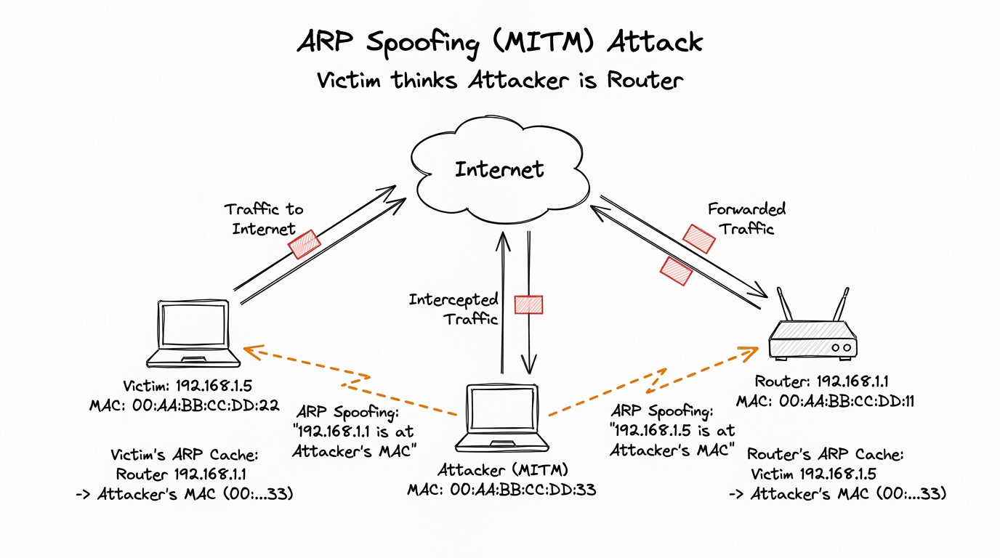

# Network Basics for Hackers
## Module 07 - ARP (Address Resolution Protocol)

---

## Overview

Address Resolution Protocol (ARP) bridges the gap between Layer 3 logical IP addresses and Layer 2 physical MAC addresses on local broadcast domains. Because ARP was designed without cryptographic authentication or reply verification, systems blindly accept unsolicited ARP frames. This fundamental architectural trust enables ARP poisoning and Man-in-the-Middle (MITM) interception on Ethernet networks.

---

## What ARP Does

Every device on a network has two addresses:

- An **IP address** - the logical address used for routing (Layer 3)
- A **MAC address** - the physical address burned into the network card (Layer 2)

IP addresses are what you use to find a device across the internet. MAC addresses are what your local network uses to actually deliver frames to the right hardware. The problem is, how does your machine know which MAC address corresponds to which IP on the local network?

That's ARP. Address Resolution Protocol. It maps IPs to MACs so local delivery works.

---

## How ARP Works

The process is simple. Almost too simple.

Say your machine wants to send data to `192.168.1.1` (your router). It checks its ARP cache first - a local table of IP to MAC mappings it already knows. If it's not there, it broadcasts a request to everyone on the network:

```
[Your machine] -> broadcasts to everyone:
"Hey, who has 192.168.1.1? Tell me your MAC address."

[Router] -> replies directly to you:
"That's me. My MAC is AA:BB:CC:DD:EE:FF"

[Your machine] -> stores this in the ARP cache and sends the data.
```

As a diagram:

```
Your Machine                  Everyone on LAN
     |                              |
     |-- ARP Request (broadcast) -->|  "Who has 192.168.1.1?"
     |                              |
     |<-- ARP Reply ----------------+  "I do, MAC = AA:BB:CC:DD:EE:FF"
     |                              |
  Stores in ARP cache, sends data
```

This happens constantly in the background. Every time you talk to a device on your local network that isn't in your ARP cache, an ARP exchange happens first.

---

## The Fatal Flaw

ARP has no authentication. None at all.

When your machine gets an ARP reply, it just believes it. No verification, no challenge, no way to confirm the reply came from the actual device. If someone sends a reply that says "I'm the router," your machine updates its ARP cache and starts sending traffic to that device.

ARP also accepts unsolicited replies. You don't even have to send a request for your machine to update its cache. Someone can just send a fake ARP reply out of nowhere and many systems will accept it.

This is called **ARP Spoofing** (or ARP Poisoning).

---

## ARP Spoofing - How It Works

The attack is straightforward. The attacker sends fake ARP replies to both the victim and the router, telling each one that the attacker's MAC address belongs to the other's IP.



```
Normal traffic flow:
[Victim 192.168.1.5] <-----------> [Router 192.168.1.1]

After ARP spoofing:
[Victim 192.168.1.5] -> [Attacker] -> [Router 192.168.1.1]
                              |
                         reads everything
                         passing through
```

The victim thinks they're talking to the router. The router thinks it's talking to the victim. The attacker is sitting in the middle, forwarding traffic between them so nothing seems broken - while reading everything that passes through.

This is a **Man-in-the-Middle attack**. ARP spoofing is the most common way to get into that position on a local network.

---

## Checking Your ARP Cache

```bash
# Show your current ARP cache (IP to MAC mappings)
ahegazy0@kali:~$ arp -a

# Example output:
# ? (192.168.1.1) at aa:bb:cc:dd:ee:ff [ether] on eth0
# ? (192.168.1.20) at 11:22:33:44:55:66 [ether] on eth0
```

If your router's MAC address in the ARP cache suddenly changes to something unexpected, that's a red flag. Someone may be ARP poisoning your network.

---

## Network Discovery with netdiscover

`netdiscover` sends ARP requests to find every active device on a subnet. It's passive and active at the same time - it watches for ARP traffic and also actively sends its own requests.

```bash
# Actively scan a subnet
ahegazy0@kali:~$ sudo netdiscover -r 192.168.1.0/24

# Passive mode - just listen for ARP traffic, don't send anything
ahegazy0@kali:~$ sudo netdiscover -p

# Scan a specific interface
ahegazy0@kali:~$ sudo netdiscover -i eth0 -r 192.168.1.0/24
```

Output gives you IP, MAC, and often a vendor name based on the MAC prefix. That vendor name is useful - it tells you what kind of device you're looking at before you even scan it.

---

## Performing ARP Spoofing - arpspoof

`arpspoof` is the basic tool for this. It continuously sends fake ARP replies to poison a target's cache.

```bash
# Enable IP forwarding first (so traffic still flows through you)
ahegazy0@kali:~$ sudo sysctl -w net.ipv4.ip_forward=1

# Tell the victim that you are the router
ahegazy0@kali:~$ sudo arpspoof -i eth0 -t <victim_IP> <router_IP>

# Tell the router that you are the victim (run in a second terminal)
ahegazy0@kali:~$ sudo arpspoof -i eth0 -t <router_IP> <victim_IP>
```

Both commands need to run at the same time. The first poisons the victim's cache. The second poisons the router's cache. Together they put you in the middle of the traffic flow.

With IP forwarding enabled, packets still reach their destination - the victim notices nothing. You're reading everything as it passes through.

---

## Ettercap

Ettercap automates the whole process and adds sniffing on top. It handles the ARP poisoning and captures the traffic in one tool.

```bash
# Launch Ettercap in text mode
ahegazy0@kali:~$ sudo ettercap -T -q -i eth0

# ARP poisoning between two specific hosts
ahegazy0@kali:~$ sudo ettercap -T -M arp:remote /192.168.1.5// /192.168.1.1//

# With a plugin (like searching for passwords)
ahegazy0@kali:~$ sudo ettercap -T -M arp:remote -P autoadd /192.168.1.5// /192.168.1.1//
```

Ettercap also has a GUI mode if you prefer that. It has built-in plugins for stripping HTTPS, injecting content into traffic, and extracting credentials from cleartext protocols.

---

## Why ARP Attacks Are Layer 2

ARP operates at Layer 2 of the OSI model - the Data Link layer. This is important for a few reasons:

- ARP only works on the **local network segment**. Broadcasts don't cross routers. You can't ARP spoof a machine in another country or even another subnet. You have to be on the same local network.
- This means ARP attacks are insider threats - they require local network access. Physical access, a compromised machine on the network, or access through Wi-Fi.
- VLANs can limit ARP attack scope by separating broadcast domains (same principle as subnetting from Module 2).

---

## Defense

**Static ARP entries** - manually set the IP to MAC mapping for critical devices like your router. A static entry won't be overwritten by a fake ARP reply.

```bash
# Add a static ARP entry
ahegazy0@kali:~$ sudo arp -s 192.168.1.1 aa:bb:cc:dd:ee:ff

# View current ARP table
ahegazy0@kali:~$ arp -a
```

The downside is it doesn't scale. You can't manually set static entries for every device on a large network.

**Dynamic ARP Inspection (DAI)** - a feature on managed switches that validates ARP packets against a trusted DHCP binding table. If an ARP reply doesn't match what DHCP assigned, the switch drops it. This is the proper enterprise solution.

**Detection** - tools like `arpwatch` monitor your network and alert when MAC addresses change unexpectedly.

```bash
# Install and run arpwatch
ahegazy0@kali:~$ sudo apt install arpwatch
ahegazy0@kali:~$ sudo arpwatch -i eth0
```

---

## Quick Reference

| Topic | Detail |
|-------|--------|
| OSI Layer | Layer 2 - Data Link |
| Purpose | Maps IP addresses to MAC addresses |
| Weakness | No authentication on replies |
| Main attack | ARP Spoofing / ARP Poisoning |
| Attack result | Man-in-the-Middle position |
| Scope | Local network only, doesn't cross routers |
| Defense | Static ARP, Dynamic ARP Inspection, arpwatch |

---

## Practice

```bash
# 1. Check your ARP cache
ahegazy0@kali:~$ arp -a

# 2. Scan your local network with netdiscover
ahegazy0@kali:~$ sudo netdiscover -r 192.168.1.0/24

# 3. Enable IP forwarding
ahegazy0@kali:~$ sudo sysctl -w net.ipv4.ip_forward=1
ahegazy0@kali:~$ cat /proc/sys/net/ipv4/ip_forward

# 4. Set a static ARP entry for testing
ahegazy0@kali:~$ sudo arp -s 192.168.1.1 aa:bb:cc:dd:ee:ff
ahegazy0@kali:~$ arp -a
```

- [ ] Inspect your local ARP cache with `arp -a` and note your default gateway's MAC address.
- [ ] Discover active devices on your subnet using `sudo netdiscover -r <subnet>` and identify hardware vendors from MAC OUIs.
- [ ] Understand the role of kernel IP forwarding (`net.ipv4.ip_forward`): What happens to the victim if traffic is intercepted without forwarding?
- [ ] Configure a static ARP entry on Linux and explain why static mapping resists gratuitous ARP spoofing.
- [ ] Explain why ARP attacks are restricted to local Layer 2 broadcast domains and cannot traverse Layer 3 routed boundaries.

> 💡 *For deeper practice, I also recommend completing the end-of-chapter exercises in the official **Network Basics for Hackers** book.*

---

*Up next: Module 08 - DNS (The Internet's Phonebook)*
