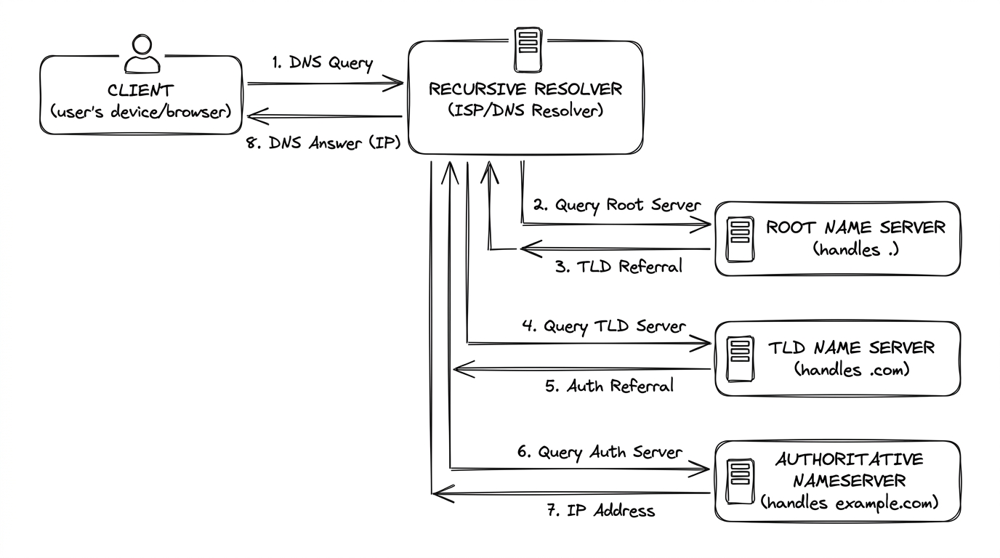

# Network Basics for Hackers
## Module 08 - DNS (Domain Name System)

---

## Overview

The Domain Name System (DNS) operates as the distributed hierarchical directory of the internet, resolving human-friendly domain names to machine-routable IP addresses. Because legacy DNS queries travel unencrypted over UDP port 53 without inherent origin authentication, DNS is vulnerable to reconnaissance, zone transfer leakage, cache poisoning, and DNS tunneling.

---

## What DNS Does

When you type `google.com` into your browser, your computer has no idea where that is. It only knows how to send packets to IP addresses. DNS is what bridges the gap - it translates human-readable names into IP addresses that routers can work with.

Without DNS, you'd have to memorize `142.250.80.46` instead of `google.com`. DNS makes the internet usable. Which also makes it critical infrastructure, and critical infrastructure is always a target.

---

## How DNS Resolution Works

DNS is hierarchical. There isn't one giant phonebook somewhere - it's a distributed system of servers that delegate responsibility for different parts of the namespace.



When you type a domain name, here's what actually happens:

```
Your Browser
     |
     v
[Recursive Resolver]  <- usually your ISP or 8.8.8.8
     |
     | "I don't know google.com, let me ask"
     v
[Root Name Server]    <- 13 root server clusters worldwide
     |
     | "I don't know google.com but .com is handled by Verisign"
     v
[TLD Name Server]     <- handles .com, .org, .net etc.
     |
     | "google.com is handled by Google's own name servers"
     v
[Authoritative Name Server]  <- Google's DNS servers
     |
     | "google.com = 142.250.80.46"
     v
[Your Browser]        <- now connects to that IP
```

This whole process takes milliseconds. The result gets cached at multiple points so the same lookup doesn't happen again for every request.

---

## DNS Record Types

DNS isn't just for mapping names to IPs. There are different record types for different purposes:

| Record | Purpose |
|--------|---------|
| A | Maps a domain name to an IPv4 address |
| AAAA | Maps a domain name to an IPv6 address |
| MX | Points to the mail servers for a domain |
| CNAME | Creates an alias pointing to another domain name |
| NS | Lists the authoritative name servers for a domain |
| TXT | Stores arbitrary text, used for SPF, DKIM, domain verification |
| PTR | Reverse DNS - maps an IP back to a name |
| SOA | Start of Authority - metadata about a DNS zone |

From a recon perspective, MX and NS records are particularly useful. MX records tell you what mail infrastructure a company uses. NS records tell you who manages their DNS, which is a good pivot point for further investigation.

---

## DNS Queries with dig and nslookup

```bash
# Basic lookup - get the A record for a domain
ahegazy0@kali:~$ dig google.com

# Get a specific record type
ahegazy0@kali:~$ dig google.com MX
ahegazy0@kali:~$ dig google.com NS
ahegazy0@kali:~$ dig google.com TXT
ahegazy0@kali:~$ dig google.com AAAA

# Short output (just the answer)
ahegazy0@kali:~$ dig google.com +short

# Query a specific DNS server instead of your default
ahegazy0@kali:~$ dig @8.8.8.8 google.com

# Reverse DNS lookup (IP to name)
ahegazy0@kali:~$ dig -x 8.8.8.8

# Trace the full resolution path from root
ahegazy0@kali:~$ dig google.com +trace
```

`nslookup` is the Windows-friendly alternative, also available on Linux:

```bash
ahegazy0@kali:~$ nslookup google.com
ahegazy0@kali:~$ nslookup -type=MX google.com
ahegazy0@kali:~$ nslookup -type=NS google.com
```

The `+trace` flag in dig is especially useful for understanding the full chain. It shows every step from the root servers down to the authoritative answer.

---

## /etc/hosts - The Personal Phonebook

Before your machine ever touches DNS, it checks `/etc/hosts`. This is a local file that maps hostnames to IPs directly. Entries here always override DNS.

```bash
# View your hosts file
ahegazy0@kali:~$ cat /etc/hosts

# Typical contents:
# 127.0.0.1   localhost
# ::1         localhost
# 192.168.1.10  myserver.local
```

To edit it you need root:

```bash
ahegazy0@kali:~$ sudo nano /etc/hosts
```

Add a line like `127.0.0.1 google.com` and your machine will stop resolving google.com through DNS entirely. It just goes straight to 127.0.0.1 (your own machine) instead.

This is exactly how malware redirects browsers to fake sites locally. It's also why attackers check the hosts file during an investigation - if something unusual is in there, DNS poisoning may have already happened at the OS level.

---

## Zone Transfers

A DNS zone transfer (AXFR) is a mechanism for copying an entire DNS zone from a primary server to a secondary server. The idea is that if your primary DNS server goes down, your secondary already has all the records and can take over.

The security problem: if a DNS server is misconfigured to allow zone transfers from anyone, an attacker can request a complete dump of every DNS record in that zone. Every subdomain, every server, every internal hostname the organization uses.

```bash
# Attempt a zone transfer
ahegazy0@kali:~$ dig axfr @ns1.example.com example.com

# With host command
ahegazy0@kali:~$ host -t axfr example.com ns1.example.com
```

If the server is properly configured, you'll get a transfer failed message. If it's misconfigured, you get the entire zone - essentially a full map of the organization's infrastructure handed to you.

Most modern DNS servers have this locked down, but it still gets missed on internal DNS servers and older infrastructure.

---

## DNS Cache Poisoning

DNS resolvers cache responses to speed things up. Your resolver asks for `bank.com`, gets an answer, stores it for the TTL period, and serves that cached answer to everyone who asks.

Cache poisoning attacks corrupt that cache with a fake answer. The attacker races to send a spoofed DNS response before the real one arrives, or exploits a vulnerability in how the resolver validates responses. If they win, the cache gets updated with a fake IP - and every device using that resolver gets sent to the wrong place.

```
Normal:
User asks "what's the IP of bank.com?"
Resolver checks cache - cache says 192.0.2.1
User goes to 192.0.2.1 (real bank)

After cache poisoning:
User asks "what's the IP of bank.com?"
Resolver checks cache - cache now says 10.0.0.99 (attacker's server)
User goes to 10.0.0.99 (fake bank, harvests login)
```

The victim's browser shows the correct domain name in the address bar. The page might look identical to the real site. They have no easy way to know something is wrong.

---

## DNSSEC

DNSSEC (DNS Security Extensions) was built specifically to address cache poisoning. It adds digital signatures to DNS records. When your resolver gets a response, it can verify the signature against a public key and confirm the record hasn't been tampered with.

The chain of trust works like this: the root servers sign records for TLD servers, TLD servers sign records for authoritative servers, and so on down the chain. A poisoned record would fail signature verification and get rejected.

DNSSEC doesn't encrypt DNS traffic (that's DNS over HTTPS/TLS), it just verifies integrity. The downside is that not every domain has DNSSEC configured, and not every resolver validates it.

---

## DNS as a Recon Tool

Before any attack on an organization, DNS is one of the first places to look. It reveals a lot:

```bash
# Find all name servers for a domain
ahegazy0@kali:~$ dig NS target.com

# Find mail servers (reveals email provider, possible spam filters)
ahegazy0@kali:~$ dig MX target.com

# TXT records often contain security policies and verification tokens
ahegazy0@kali:~$ dig TXT target.com

# Try a zone transfer attempt
ahegazy0@kali:~$ dig axfr @ns1.target.com target.com

# Brute-force subdomains
ahegazy0@kali:~$ dnsenum target.com
ahegazy0@kali:~$ fierce --domain target.com
```

A company's DNS records can tell you what cloud provider they use, what email security they have, what services they run publicly, and sometimes reveal internal infrastructure if zone transfers are open.

---

## BIND - Building a DNS Server

BIND (Berkeley Internet Name Domain) is the most widely used DNS server software on Linux. OTW covers building your own DNS server with BIND as a hands-on exercise - it's the best way to truly understand how DNS works because you configure every record yourself.

```bash
# Install BIND
ahegazy0@kali:~$ sudo apt install bind9

# Main config files:
# /etc/bind/named.conf
# /etc/bind/zones/

# Check config syntax
ahegazy0@kali:~$ sudo named-checkconf

# Restart service after changes
ahegazy0@kali:~$ sudo systemctl restart bind9

# Test your server locally
ahegazy0@kali:~$ dig @127.0.0.1 yourdomain.local
```

Running your own DNS server also gives you a clear view of what attacks look like from the server side - failed zone transfer attempts, unusual query patterns, cache behavior.

---

## Quick Reference

| Record | What it does |
|--------|-------------|
| A | Domain to IPv4 |
| AAAA | Domain to IPv6 |
| MX | Mail servers for the domain |
| CNAME | Alias to another name |
| NS | Authoritative name servers |
| TXT | Text records (SPF, DKIM, verification) |
| PTR | IP to domain name (reverse DNS) |

| Attack | How it works |
|--------|-------------|
| Cache Poisoning | Corrupt a resolver's cache with fake records |
| Zone Transfer Abuse | Pull every DNS record from a misconfigured server |
| DNS Hijacking | Change authoritative records at the registrar level |
| DNS Tunneling | Exfiltrate data by encoding it inside DNS queries |

---

## Practice

```bash
# 1. Query A and MX records
ahegazy0@kali:~$ dig google.com +short
ahegazy0@kali:~$ dig MX gmail.com

# 2. Trace the full recursive resolution path
ahegazy0@kali:~$ dig google.com +trace

# 3. Test local host resolution override
ahegazy0@kali:~$ cat /etc/hosts
```

- [ ] Query A, MX, NS, and TXT records for a target domain using `dig`.
- [ ] Trace the recursive lookup path from root servers down to authoritative servers with `dig +trace`.
- [ ] Test local name resolution priority by adding a temporary entry in `/etc/hosts` and verifying with `ping`.
- [ ] Attempt an AXFR zone transfer against a test or authorization-permitted server with `dig axfr @<ns> <domain>`.
- [ ] Explain how DNSSEC cryptographic signatures protect against recursive resolver cache poisoning attacks.

> 💡 *For deeper practice, I also recommend completing the end-of-chapter exercises in the official **Network Basics for Hackers** book.*

---

*Up next: Module 09 - SMB (Server Message Block)*
