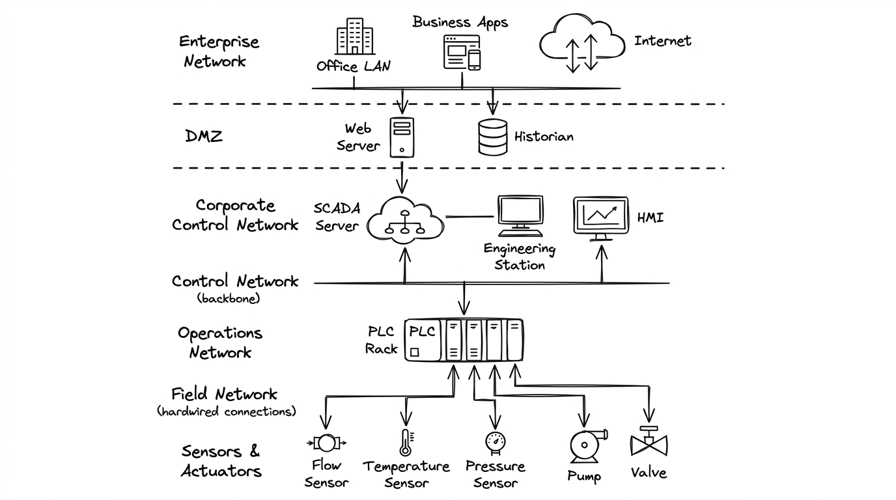

# Network Basics for Hackers
## Module 14 - SCADA & Industrial Control Systems

---

## Overview

Supervisory Control and Data Acquisition (SCADA) and Industrial Control Systems (ICS) monitor and automate critical physical infrastructure - power grids, water treatment facilities, chemical plants, and manufacturing lines. Because protocols like Modbus/TCP lack authentication, origin validation, and encryption, securing industrial environments relies heavily on network segmentation models (such as the Purdue Enterprise Reference Architecture) and air-gap hygiene.

---

## What SCADA Actually Is

SCADA stands for Supervisory Control and Data Acquisition. It's an umbrella term for the systems that monitor and control physical industrial processes. Power generation, water treatment, oil pipelines, factory assembly lines, building management - all of it runs on some form of SCADA or ICS (Industrial Control System).

The key components:

- **PLC (Programmable Logic Controller)** - the small ruggedized computer that directly interfaces with physical equipment. It reads sensors (temperature, pressure, flow rate) and controls actuators (valves, pumps, motors, switches). PLCs are the actual "brains" that make physical things happen.
- **RTU (Remote Terminal Unit)** - similar to a PLC, used for geographically distributed installations like pipelines or power substations.
- **HMI (Human-Machine Interface)** - the control panel operators use to monitor and interact with the system. Can be a physical panel or software on a workstation.
- **Historian** - a server that logs all sensor readings and events over time for analysis and compliance.
- **Engineering Workstation** - where engineers program and configure PLCs.

```
[Physical World]         [Control Layer]         [Supervisory Layer]
 Sensors, Valves,  <-->  PLCs / RTUs       <-->  SCADA Server / HMI
 Motors, Pumps           (Modbus, DNP3)           (Operator Screens)
                              |
                         [Corporate Network]
                         (sometimes connected,
                          should not be)
```

The architecture was designed in an era when these systems were physically isolated - air-gapped from everything else. That isolation was the security model. It no longer holds for most installations.

---

## Modbus - The Protocol

Modbus was developed in 1979 by Modicon for communicating with PLCs. It became the industry standard and is still used in an enormous number of industrial devices today.

The protocol is simple. A master device sends requests, slave devices (PLCs, sensors) respond. Originally it ran over serial lines. Modbus/TCP is the modern version that runs over standard Ethernet on port 502.

A Modbus request specifies:
- Which device to talk to (slave address)
- What function to perform (read or write)
- Which data address to access

Modbus organizes data into four types:

| Data Type | Access | What it stores |
|-----------|--------|---------------|
| Coils | Read/Write | Single bit - ON/OFF values (valve open/closed, motor on/off) |
| Discrete Inputs | Read only | Single bit inputs from sensors |
| Holding Registers | Read/Write | 16-bit values (setpoints, configuration) |
| Input Registers | Read only | 16-bit values from sensors (temperature, pressure, flow) |

```
Modbus TCP Frame:
| Transaction ID | Protocol ID | Length | Unit ID | Function Code | Data |
|    2 bytes     |   2 bytes   | 2 bytes| 1 byte  |    1 byte     |  N   |

Function codes:
0x01 - Read Coils
0x03 - Read Holding Registers
0x05 - Write Single Coil
0x06 - Write Single Register
0x0F - Write Multiple Coils
0x10 - Write Multiple Registers
```

No authentication. No encryption. No source verification. Anyone who can reach port 502 can read and write to the device. That's the entire security model - or lack of one.

---

## Why These Systems Are Insecure

The original Modbus assumption was the same as CAN: physical isolation means nobody hostile can reach the device. In 1979, connecting an industrial controller to a network accessible from outside the facility wasn't something anyone considered.

The problem is that over the past 20 years, operational efficiency demands led to connecting OT (Operational Technology) networks to IT networks, and IT networks to the internet. Remote monitoring, remote management, vendor access, data integration with business systems - each connection made sense individually. Collectively they eliminated the isolation that was supposed to be the security.

The protocols never got updated because changing a protocol in a live industrial environment is extraordinarily risky. A power plant can't go offline for six months to replace its control protocol. So Modbus and its peers - DNP3, PROFIBUS, EtherNet/IP - are still running with 1970s-1980s security assumptions on networks that are increasingly reachable.

---

## Real-World Incidents

**Stuxnet (2010)** is the most studied ICS attack in history. It targeted Iranian uranium enrichment centrifuges running Siemens PLCs. The malware specifically targeted Siemens Step 7 software and made the centrifuges spin at the wrong speeds while reporting normal readings to operators. It caused physical destruction of the centrifuges while remaining invisible for months. Stuxnet demonstrated that digital attacks could cause precise physical damage to industrial equipment.

**Ukraine Power Grid (2015 and 2016)** - attackers compromised the SCADA systems of Ukrainian power distribution companies and remotely opened breakers, cutting power to roughly 230,000 customers. The 2016 attack used malware called Industroyer/Crashoverride that could directly speak Modbus, IEC 104, and other industrial protocols to control substation equipment.

**Oldsmar Water Treatment (2021)** - an attacker remotely accessed the HMI of a Florida water treatment plant and attempted to change the sodium hydroxide level to 111 times the normal amount. An operator noticed the cursor moving on screen and reversed it. The plant was using TeamViewer with a shared password across multiple workstations.

These incidents share a pattern: systems that were supposed to be isolated weren't, protocols with no authentication were reachable from outside, and operators had no way to detect illegitimate commands.

---

## The Exposure Problem

A significant number of industrial control systems are directly reachable from the internet. This is documented publicly by researchers who use tools like Shodan to measure the scale of exposure - not to attack systems, but to understand and report on the problem so it gets fixed.

Security researchers, ICS vendors, and organizations like ICS-CERT publish reports on this exposure specifically to pressure operators into taking these systems off the public internet. The research community treats this as a public health issue - the more visible the problem, the more likely it gets addressed.

If you're doing legitimate ICS security research or working in OT security, Shodan is a useful tool for understanding what's exposed within your own organization's IP ranges. Security teams use it to audit their own perimeter.

---

## Tools Used in ICS Security Research

These tools exist for authorized security assessments and research in lab environments:

```bash
# Nmap - scan for Modbus services
ahegazy0@kali:~$ nmap -p 502 --script modbus-discover <target>

# Show device information from a Modbus device
ahegazy0@kali:~$ nmap -p 502 --script modbus-discover --script-args='modbus-discover.aggressive=true' <target>
```

For hands-on learning, simulators exist specifically so you can practice without touching real systems:

```bash
# modbus-server - run a software Modbus slave for testing
ahegazy0@kali:~$ pip install pymodbus

# Or use dedicated ICS simulation environments:
# - GNS3 with ICS device images
# - ScadaBR (open source SCADA platform for testing)
# - Factory I/O (industrial simulation software)
```

All ICS security labs and certifications use simulated environments. Working on real industrial systems without explicit authorization is both illegal and potentially dangerous to people who depend on that infrastructure.

---

## Defense and the Air Gap

The primary defense recommendation hasn't changed: **separate OT networks from IT networks and from the internet**.



```
[Internet]
     |
  Firewall
     |
[Corporate IT Network]
     |
  Firewall / Data Diode
     |
[OT DMZ / Historian]
     |
  Firewall (strict, unidirectional preferred)
     |
[OT Network - PLCs, RTUs, HMIs]
     |
[Physical Equipment]
```

Beyond network segmentation:

- **Patch what can be patched** - some PLCs can't be updated, but HMIs, historians, and engineering workstations often can
- **Application whitelisting** on HMIs and engineering workstations - only approved software runs
- **Remove remote access** where it isn't absolutely necessary. When it is necessary, use a jump server with MFA, not direct VPN to the OT network
- **Monitor for anomalies** - OT networks are highly predictable. The same devices talk to the same devices in the same patterns. Anything outside that baseline is suspicious.
- **Vendor access management** - third-party vendors needing remote access is a major risk vector. Use temporary, monitored, time-limited sessions.

**ICS-specific security frameworks:**
- NIST SP 800-82 (Guide to ICS Security)
- IEC 62443 (Industrial Automation and Control Systems Security)
- NERC CIP (for power grid specifically)

---

## Quick Reference

| Term | What it means |
|------|-------------|
| PLC | Programmable Logic Controller - interfaces directly with physical equipment |
| RTU | Remote Terminal Unit - like a PLC for distributed sites |
| HMI | Human-Machine Interface - operator control panel |
| SCADA | Supervisory Control and Data Acquisition - the overall system |
| Modbus | Industrial protocol from 1979, no auth, no encryption |
| Port 502 | Default Modbus/TCP port |
| Coil | Single bit read/write value (ON/OFF) |
| Register | 16-bit value (sensor reading, setpoint) |
| Air gap | Physical network isolation - the original security model |
| OT | Operational Technology - the industrial control network |

---

## Practice

```bash
# 1. Install simulation libraries in lab environment
ahegazy0@kali:~$ pip install pymodbus

# 2. Probe for local Modbus TCP listener
ahegazy0@kali:~$ nmap -p 502 --script modbus-discover localhost
```

- [ ] Study the Purdue Enterprise Reference Architecture and identify boundary controls between Level 2/3 (Control/Operations) and Level 4/5 (Enterprise/IT).
- [ ] Install `pymodbus` to simulate a local virtual PLC slave controller.
- [ ] Scan the local test server with `nmap -p 502 --script modbus-discover` to extract device parameters.
- [ ] Review published ICS-CERT advisories on CISA's catalog and identify recurring vulnerabilities across industrial automation vendors.
- [ ] Contrast IT vs OT priorities (Confidentiality vs Availability/Safety): Why are regular automated software patches and vulnerability scans often prohibited on live industrial lines?

> 💡 *For deeper practice, I also recommend completing the end-of-chapter exercises in the official **Network Basics for Hackers** book.*

---

*Up next: Module 15 - RF & Software Defined Radio*
